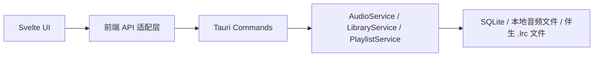
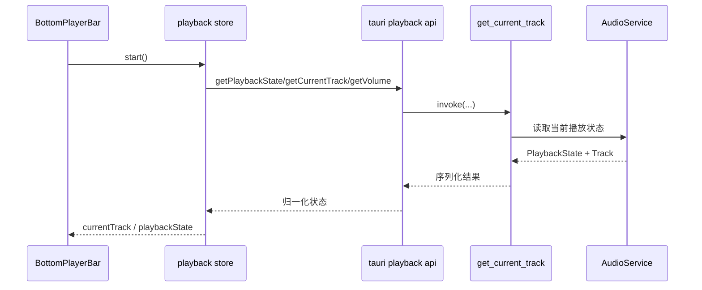

# 架构设计

## 总体架构

## 技术栈
- 后端: Rust、Tauri 2、rodio、rusqlite、lofty
- 前端: Svelte 5、TypeScript、Vite、Vitest
- 数据: SQLite 曲库数据库 + 本地文件系统

## 核心流程

## 重大架构决策

| adr_id | title | date | status | affected_modules | details |
|--------|-------|------|--------|------------------|---------|
| ADR-20260320-local-lyrics | 本地歌词首版采用同名 `.lrc` 伴生文件，并在切歌时一次性注入当前播放曲目 | 2026-03-20 | ✅已采纳 | backend-audio, frontend-player | 待实现后补充到历史方案链接 |

